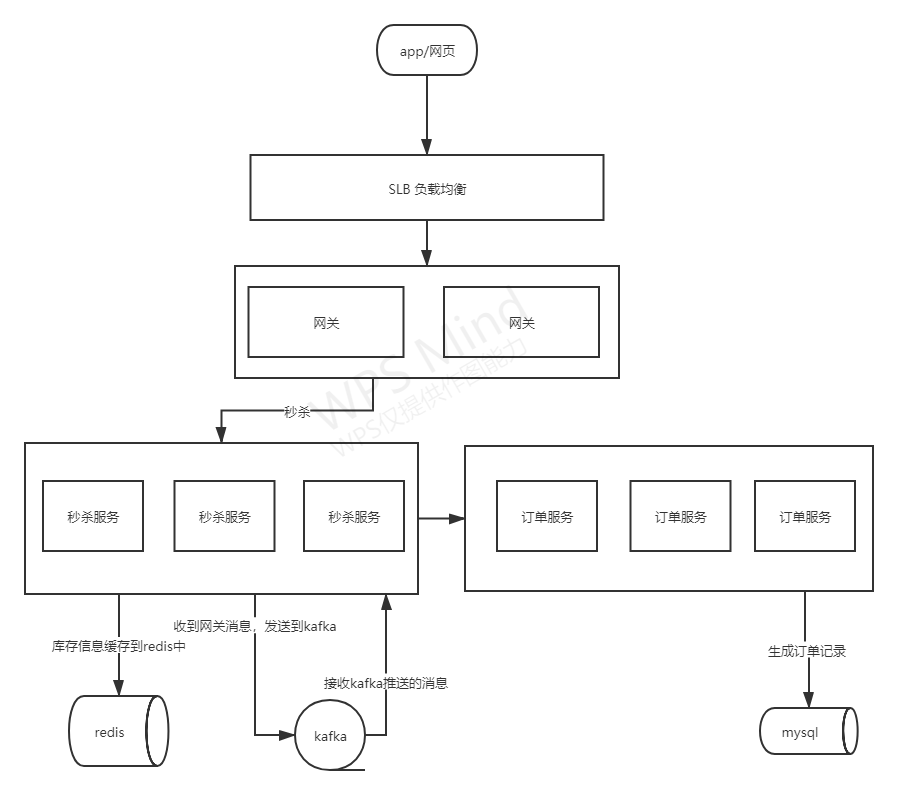
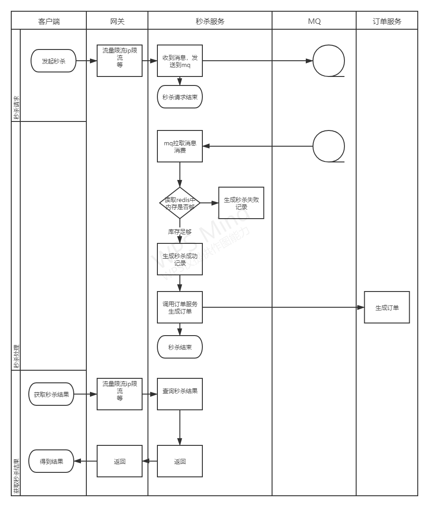

**这是第14周作业**    

## 第14周第2课作业1：（必做）针对课上讲解的内容，自己动手设计一个高并发的秒杀系统
秒杀系统可以用于各种业务，本作业是设计电商平台秒杀商品的系统。    

架构图，流程图如下：  
  

  
  
架构设计思路：  
1.网关进行限流。  
2.每个服务部署多个节点，避免单节点宕机问题。  
3.将秒杀服务和订单服务分开，应对不同需求增减服务节点。  
4.使用mq，缩短单个请求响应，提高并发。同时也起到削峰填谷的作用。  
5.使用redis缓存库存数据。  
  
业务设计思路：   
1.秒杀分为两步，先是客户端发起秒杀；然后是获取秒杀结果  
2.在网关处进行限流。ip限流，单个用户id只允许请求一次，等。    
3.秒杀服务接收到请求后，先发送到mq中。 然后再拉取mq的消息，进行业务处理   
4.库存数量缓存在redis中，使用redis原子减操作。减到0则无库存，秒杀失败，生成秒杀失败记录。  
5.扣减库存成功的，调用订单服务，生成订单，生成秒杀成功记录。  
