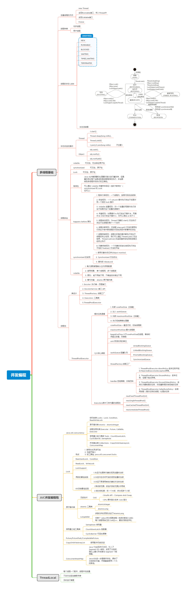

**这是第15周作业**    
- 目录
    - 学习心得总结
    - 第15周第2课作业3：（必做）分别用100个字以上的一段话，加上一幅图（架构图或脑图），总结自己 对下列技术的关键点思考和经验认识
        - 1）JVM   
        - 2）NIO
        - 3）并发编程
        - 4）Spring和ORM等框架
        - 5）MySQL数据库和SQL
        - 6）分库分表
        - 7）RPC和微服务
        - 8）分布式缓存
        - 9）分布式消息队列

## 学习心得总结
这4个月左右的学习，让我对java知识体系有了完整的了解，让我知道了精通java需要搞懂的领域，指明了我学习、复习的道路：    
jvm模块，让我对字节码有力更深入的了解，更加信息的明白jvm是怎么回事，了解了怎么去调优。  
学习了NIO，学习了nio的底层原理，netty的实现原理，netty的使用，等等。  
对JUC并发包下的类有了更深入的理解，理解了它们背后的原理。  
对spring starter也有了很深入的了解，还自己手敲了一个自定义的starter类，原理一点也不难。    
温习了MySQL，同时也学习了分库分表，之前是没怎么了解过，对分布式事务也更加清晰明了了。  
学习了dubbo技术架构和原理，学习了分布式服务的整体现状，发展现状。    
更加熟悉了分布式缓存，redis等的使用。  
对mq有了更全面的了解，包括mq发展现状，最前沿的mq技术。  

后续，自己还需要反复查看秦老师的视频，认真总结，将知识转化为自己的东西。  
最后，感谢秦老师、助教们、班主任、教研等各位老师这段时间的指导与陪伴。  

## 第15周第2课作业3：（必做）分别用100个字以上的一段话，加上一幅图（架构图或脑图），总结自己 对下列技术的关键点思考和经验认识
思维导图见对应名称的图片
### 1）JVM   
 
### 2）NIO
 
### 3）并发编程
 
### 4）Spring和ORM等框架
 
### 5）MySQL数据库和SQL
 
### 6）分库分表
 
### 7）RPC和微服务
 
### 8）分布式缓存
 
### 9）分布式消息队列
 

 
